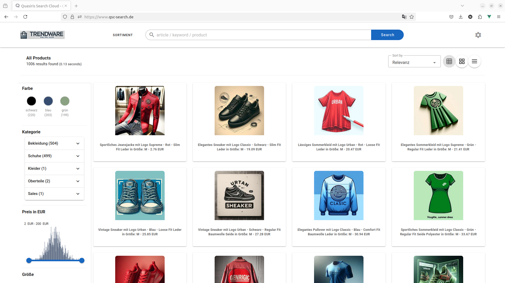
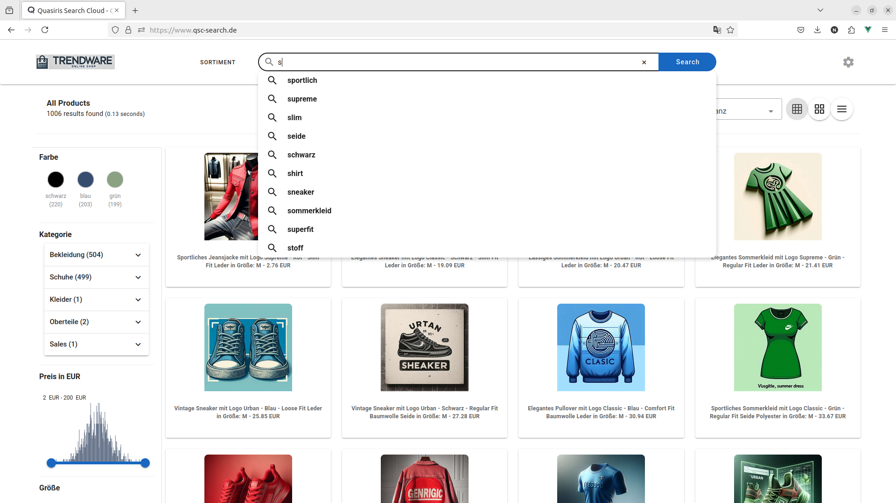
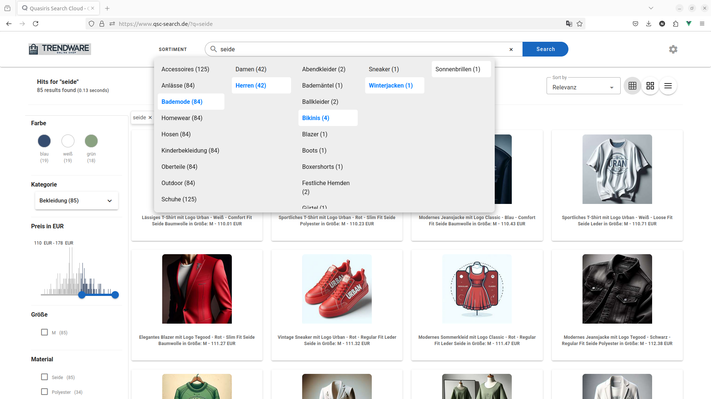
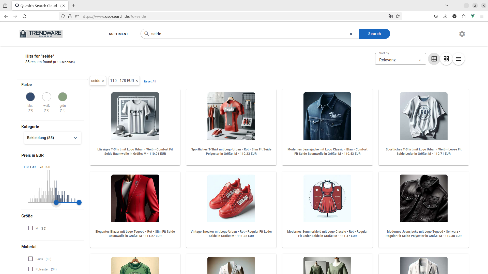

# qsc-quickstart-vue3

## Overview
This project proved a configurable e-commerce template built with Vue.js 3 and Vuetify 3,
designed for rapid integration of the Quasiris Search Cloud APIs.
The template is flexible and allows users to easily customize its behavior through a configuration file (`config.json`).
This project helps you set up an ecommerce search quickly by configuring endpoints and templates in a Vue.js environment.

## Project Setup

install dependencies, compile, and run the project, follow these commands:

### Install dependencies
```
npm install
```

### Compiles and hot-reloads for development
```
npm run serve
```

### Compiles and minifies for production
```
npm run build
```

### Lints and fixes files
```
npm run lint
```

## Customize configuration

The main configuration file for this project is config.json, where you can specify various API URLs and create your own configurations.

### Custom configuration example in config.json

```
[
  {
    "id": "nam",
    "baseurl": "https://qsc-dev.quasiris.de/api/v1/search/demo/trendware",
    "suggestionUrl": "https://qsc-dev.quasiris.de/api/v1/search/suggest/demo/trendware?q=",
    "detailsUrl": "https://qsc.quasiris.de/cdn/qsc/quasiris/docs/",
    "sortimentUrl": "https://qsc-dev.quasiris.de/api/v1/category/demo/navigation-random",
    "resultSetId": "trendware",
    "logo": "https://qsc.quasiris.de/cdn/qsc/demo/trendware/shop/img/logo.png",
    "logoRedirection": "https://www.quasiris.com/",
    "document": {
      "name": "${title} : ${price}",
      "url": "url",
      "image": "image",
      "template": "<div class=\"card\">\n  <a :href=\"config.url\">\n    <div       class=\"d-flex justify-content-between align-end\">\n      <div class=\"flex-grow-1 my-3\">\n        <h6 class=\"mb-0 text-center\" style=\"color:blue;font-size: 10px;\">\n          {{config.name}}\n        </h6>\n      </div>\n    </div>\n    <div class=\"image\">  </div>\n <div v-if=\"document.available\" class=\"flex-grow-1 my-3\" ><h5 class=\"mb-0 text-center\" style=\"color:black;font-size: 12px;\">{{document.price}}</h5> </div></a>\n</div>"
    },
    "rows": [
      { "id": 24, "name": "24 records" },
      { "id": 48, "name": "48 records" },
      { "id": 72, "name": "72 records" }
    ]
  }
]
```

### Key Configuration Fields

- **id**: A unique identifier for the configuration, set `1`  for default configuration. (Required)
- **baseurl**: API endpoint for fetching products data. (Required)
- **suggestionUrl**: API endpoint for search bar suggestions. (Required) 
- **sortimentUrl**: API endpoint for the sortiment navigation. If missing, the navigation will not appear.
- **resultSetId**: Identifier for the result set in the API response. This is critical for rendering the results. (Required)
- **logo**: URL of your shop logo. (Required)
- **logoRedirection**: Defines the link destination for the main logo. If not specified, clicking the main logo will redirect the user to the home page, clearing all route parameters in the process.
- **document**: Configurable object containing keys such as:
  - **name**: The product title displayed in the UI. (Required if no Template used)
  - **url**: Specifies the product details page URL. This field is required if no template is used. a direct link can be assigned, as shown in the previous example.
  - **image**: URL of the product image.
  - **template**: Optional Vue.js template for customizing product card display. 
    - Inside the template json, you can use the `document` object to refer to product fields from the API response.
    - You can also use the `config` object to refer to configured fields such as name, url, etc. from this configuration. 
    - If missing, deafult product card template will be used.
- **rows**: Defines the number of records displayed per page. If omitted, default values will be used.

## Screenshots

Here are a few screenshots to help visualize how the project looks when running:

### Home Page

### Search Suggestions

### Sortiment Navigation

### Applied filters 


## How to Use the Configuration

Modify API URLs: Update baseurl, suggestionUrl, and sortimentUrl to point to your own API endpoints.
Customize Product Display: Update the document object to map API response fields to your desired display configuration.

```
{ ...
  "document": {
    "name": "${title} : ${price}",
    "url": "url",
    "image": "image",
    "template": "<div class='product-card'><a :href='config.url'><div class=\"image\"></div>{{config.name}}</a></div>"&
  }
}
```
### Document configuration fields :

in this Custom configuration example, we define the name field by combining the product's title and price, separated by a colon and for url and image we directly use Api fields.

### Explanation of the Template field:

```html
<div class='product-card'>
   <a :href='config.url'>
      <div class="image">
          
       </div>
      {{config.name}}
   </a>
</div>
```
- **Custom template**: Custom template example will generate a product card where:
    - The product name and price are displayed as the title `config.name`.
    - The image is shown if image is loaded from the API response `v-if=\"config.image && document.image\"`.
    - The link points to the product's detail page using the url field from the API `config.url`.

## Example API Response

Here’s a simplified example of what the API response from the [baseurl](https://qsc-dev.quasiris.de/api/v1/search/demo/trendware) might look like.

## Vue.js Integration

This project is built with Vue.js 3, allowing easy integration of reactive components.
You can modify the components or extend them as needed. The config.json helps you 
control what data is shown without modifying the core Vue.js code.